# 🎯 Hunt System Technical Documentation

> *A comprehensive guide to the Hunt system architecture and implementation*

## 🌟 System Overview

Hunt enables players to send their Luminals on strategic expeditions for resources, experience, and rewards. This documentation serves as the technical reference for developers.

#### Hunt Architecture Mindmap {collapsible="true"}


## 🏰 Core Architecture

### Hunt Locations

<tabs>
    <tab title="Wildwood Forest">
        
        Wildwood Forest allows players to gather brownwood (mandatory  for some shop items).
    </tab>
    <tab title="Sunbaked Desert">
        
        Sunbaked Desert allows players to gather build tokens (mandatory for any build related systems).
    </tab>
    <tab title="Winter Wonderland">
        
        Winter Wonderland allows players to gather snowflakes (mandatory for some shop items and winter event) [WINTER EVENT ONLY MAP].
    </tab>
</tabs>

## 💻 System Components

Hunts are generated procedurally based on a set of tiles and events. The system is designed to be modular and extensible.
Hunts are a semi-afk system:
* Luminals run on their own
* Players can interact with Luminals to increase success rate, reduce time, and gain additional rewards

Interactions are limited to:
* Petting
* Feeding
* Special Encounters

### 🎮 Hunt Party System 
```typescript
// Core party management interface
export interface IHuntDocument extends Document {
    userId?: string;
    creatureId?: number;
    startTime?: Date;
    endTime?: Date;
    huntType?: string;
    duration?: number;
    status?: string;
    path?: { x?: number; y?: number; tileType?: number }[];
    tileMap?: number[][];
    essencesCollected?: {
        Fire?: number;
        Water?: number;
        Flora?: number;
        Air?: number;
        Neko?: number;
        Dark?: number;
        Light?: number;
    };
    events?: string[];
    experienceGained?: number;
    bonusMap?: boolean;
    bonusLuminal?: number;
    lastPetTime?: Map<string, Date>;
    lastFoodTime?: Map<string, Date>;
    bonusCare?: number;
    successRate?: number;
    isNotified?: boolean;
    bonusHuntXp?: number;
    lastRandomEvent?: Date;
}
```

For now, hunts does not reward with essences, but it is planned to be implemented in the future as it is the core of the final reward system.

### 🛠 Current Hunt Tree (`huntUtils.ts`)
```bash
│   huntParty.ts
│
└───huntSystem
    │   huntUtils.ts
    │
    ├───draw
    │       drawHunt.ts
    │       drawRewards.ts
    │       scrollImageGenerator.ts
    │
    ├───huntManagement
    │       handleHuntProgress.ts
    │       handleNewHunt.ts
    │
    ├───luminalManagement
    │   │   huntCare.ts
    │   │   huntEvents.ts
    │   │   huntInteraction.ts
    │   │
    │   └───weather
    │       └───storm
    │               huntStorm.ts
    │               stormLuminal.ts
    │
    ├───profile
    │       huntProfile.ts
    │
    └───rewards
            handleRewards.ts
```

### 🎨 Drawing System
```typescript
const generateMapImage = async (
    hunt: IHuntDocument,
    creature: ICreaturesDocument,
    tileMap: number[][],
    focusOnCreature: boolean = false
): Promise<Buffer> => {
    // Generate map image
};
```
Similarly, the `drawRewards.ts` file contains functions to generate reward buffers.

### 🌲 Hunt Generation
The procedural generation of hunts in this project involves creating a dynamic and varied map for each hunt. Here's a step-by-step explanation:

1. **Tile Map Generation**:
    - The `generateTileMap` function creates a 2D array representing the map.
    - Each tile is initially set to a background tile specific to the hunt type (e.g., `Wildwood Realm`, `Sunbaked Frontier`, `Winter Wonderland`).
    - Features like water, mountains, and forests are added to the map based on predefined densities and clustering factors.

2. **Feature Placement**:
    - The `generateFeature` function places features (e.g., water, mountains) on the map.
    - It randomly selects positions and attempts to expand the feature based on a clustering factor, ensuring natural-looking groupings.

3. **Special Features**:
    - Clearings, villages, and other special features are added with specific probabilities.
    - These features replace the background tiles in certain conditions, adding variety to the map.

4. **Road Path Generation**:
    - The `generateRoadPath` function creates a path that the creature will follow.
    - It starts from the left side of the map and moves towards the right, occasionally curving up or down.
    - The path is represented by a series of points, each with a specific tile type.

5. **Drawing the Map**:
    - The `drawTerrain` function renders the map on a canvas.
    - It draws each tile in the correct position, ensuring that road tiles are drawn on top of the background tiles.

6. **Placing the Creature**:
    - The `placeCreatureOnRoad` function determines the creature's position based on the hunt's progress.
    - The creature is placed on the road path at a position corresponding to the elapsed time of the hunt.

7. **Rendering the Creature**:
    - The `drawCreature` function draws the creature on the map.
    - It loads the creature's image and places it at the calculated position, adding visual effects like a circular background and a pointer to the road.

8. **Generating the Final Image**:
    - The `generateMapImage` function creates the final image of the map.
    - It combines the terrain, road, and creature into a single image, optionally zooming in on the creature for a focused view.

This process ensures that each hunt map is unique and visually appealing, providing a varied experience for players.

### 🐾 Luminal Management

#### Interactive Features
<tabs>
    <tab title="Care System">
        Based on the environment around the Luminal, the  player can choose which is the best food/drink to give to the Luminal to increase success rate. In addition, the player can pet the Luminal to reduce the hunt time.
    </tab>
    <tab title="Events">
       Events are random encounters that can happen during the hunt. Only one encounter exists for now, but more are planned to be implemented.
        The encounter is called the weather event, which is a storm that can happen during the hunt, this will be explained in the weather system.
    </tab>
</tabs>

#### ⛈️ Weather System


    

### 👤 Profile System
Profile system consists of the following features:
- Player's hunter level
- Player's hunter experience
- Player's hunter title
- Player's milestones (rewards per level up with a max of 7 milestones)

#### Hunter Profile View {collapsible="true"}


### 🎁 Rewards System (`handleRewards.ts`)


#### Base Reward Calculation
```typescript
function calculateBaseReward(hunt: IHuntDocument, creature: ICreaturesDocument) {
    const durationInHours = hunt.duration / 3600000;
    const rarityMultiplier = getRarityMultiplier(creature.creatureType);
    const experienceMultiplier = Math.log10(creature.experience + 1) / 10 + 1;

    return {
        mythicalWater: Math.floor(20 * Math.sqrt(durationInHours) * rarityMultiplier * experienceMultiplier),
        experience: Math.floor(40 * Math.sqrt(durationInHours) * rarityMultiplier * experienceMultiplier)
    };
}
```

#### Location-Specific Rewards

<table>
  <tr>
    <th>Location</th>
    <th>Primary Reward</th>
    <th>Calculation</th>
  </tr>
  <tr>
    <td>Wildwood Realm</td>
    <td>Brownwood</td>
    <td>Fixed rate based on duration</td>
  </tr>
  <tr>
    <td>Sunbaked Frontier</td>
    <td>Build Tokens</td>
    <td>Random range based on duration</td>
  </tr>
  <tr>
    <td>Winter Wonderland</td>
    <td>Snowflakes</td>
    <td>Random range + Event progress</td>
  </tr>
</table>

#### Special Rewards

```mermaid
stateDiagram-v2
    [*] --> Hunt
    Hunt --> LongHunt: Duration > 3h
    LongHunt --> RareEgg: 1% Chance
    RareEgg --> EnchantedEgg: 70%
    RareEgg --> MysticEgg: 30%
    
    Hunt --> CardinalCheck: Based on Duration
    CardinalCheck --> Cardinal: 5% * √duration * expMultiplier
    Cardinal --> EnaX: Attack (40%)
    Cardinal --> EsenW: Heal (35%)
    Cardinal --> ErzaZ: Defense (25%)
```



#### Bonus Multipliers
```typescript
// Bonus Luminal: Multiply all rewards
rewards *= (1 + hunt.bonusLuminal);

// Bonus Map: 50% extra base XP and Mythical Water
if (hunt.bonusMap) {
    baseRewards *= 1.5;
}

// Bonus Care: Multiply all rewards
rewards *= (1 + hunt.bonusCare);
```


#### Reward embed view {collapsible="true"}


## 🔧 Technical Reference

### Data Flow Diagram


## 📝 Development Guidelines

### Best Practices

1. **State Management**
    - Use immutable state patterns
    - Implement proper error handling

2. **Event Handling**
    - Follow event-driven architecture
    - Implement proper logging

## 🎮 Usage Examples

### Creating a New Hunt

#### Step 1: Adding tiles to the system

```typescript
// Base template for tiles:
export const TILE_WIDTH = 32;
export const TILE_HEIGHT = 48; // the base height of each tile when cut from the sprite sheet
export const TILE_VERTICAL_OFFSET = 20; // the base offset between each row of tiles (18) + 2 for the vertical offset of tiles
```

```typescript
// Add the reference to your tiles
export const TILE_TYPES = {
    'Wildwood Realm': {
        BACKGROUND: 0, // Light green tile
        FOREST: [1, 2, 4],
        CLEARING: [14], // Lighter green tile
        WATER: [7], // Blue tile
        MOUNTAIN: [3, 5], // Mountain tiles
        VILLAGE: [8, 9], // Village tiles
        PATH: [0], // Path tiles from the bottom row
    },
    'Sunbaked Frontier': {
        BACKGROUND: 24, // Light sand tile
        DESERT: [25, 26, 27], // Various sand/desert tiles
        OASIS: [28], // Oasis tile
        VILLAGE: [30],
        RUINS: [29], // Ruin tiles
        PATH: [0], // Path tiles from the bottom row
    },
    'Winter Wonderland': {
        BACKGROUND: 16, // Light white tile
        FOREST: [17, 18],
        WATER: [21],
        MOUNTAIN: [19, 20],
        VILLAGE: [23],
        PATH: [0], // Path tiles from the bottom row
    },
    'YOUR_CUSTOM_LOCATION': {
        // Add your custom location tiles here (based on the base template of tiles above)
    }
};
```

#### Step 2: Reference the HuntType in the system, follow the existing interface:
```typescript
interface HuntType {
    name: string;
    emoji: string;
    description: string;
}
```

#### Step 3: Voilà! You have successfully added a new location to the Hunt system. Let the system handle the rest.

### Handling Rewards
Just add to the reward interface your new reward type, and add your logic to the calculateBaseReward function


---

> 📘 **Note**: This documentation is maintained by the development team. For updates or clarifications, please submit a PR.
> As of today, the development team is composed of:
> - @phanthive (Lead Developer) can be reached at hestia@phearion.fr