# ⚔️ Cardinal Battle System

Cardinals are your partners in battle, each offering unique abilities and bonuses based on their type.

## Cardinal Types

## Battle Actions

Each turn, you have three possible actions:

1. **Align** 🌟
    - Roll for constellation alignment
    - 55% chance: Same constellation (Power up ⭐)
    - 45% chance: New constellation
    - Max power: ⭐⭐⭐⭐⭐

2. **Strike** ⚔️
    - Basic attack action
    - Affected by constellations
    - Enhanced by Attack Cardinal

3. **Defend** 🛡️
    - Reduce incoming damage
    - Enhanced by Defense Cardinal

## Constellation System

```mermaid
graph TD
    Aries[Aries ♈] --> ATK[+20% Attack]
    Taurus[Taurus ♉] --> DEF[+30% Defense]
    Cancer[Cancer ♋] --> HEAL[10% HP/Turn]
    Virgo[Virgo ♍] --> CRIT[+20% Crit Chance]
    Pisces[Pisces ♓] --> DODGE[20% Dodge Chance]
```

## Type Advantages

Coming soon!

## Infinite Realms (PVE Mode)

Progress through themed realms, each with unique challenges:

1. **Cancer Realm ♋** (Levels 1-10)
    - Focus: Healing mechanics
    - Enemy buff: Constant healing

2. **Taurus Realm ♉** (Levels 11-20)
    - Focus: Defense
    - Enemy buff: 50% damage reduction

3. **Virgo Realm ♍** (Levels 21-30)
    - Focus: Precision/Critical hits
    - Enemy buff: 2x critical damage

4. **Aries Realm ♈** (Levels 31-40)
    - Focus: Aggressive combat
    - Enemy buff: Damage over time

5. **Pisces Realm ♓** (Levels 41-50)
    - Focus: Evasion and strategy
    - Special effect: No healing allowed
    - Enemy buff: 50% chance to dodge Cardinals

## Combat Tips

- Use **Align** to build constellation power when safe
- **Strike** when you have advantageous elemental alignment
- **Defend** when enemy buffs are active or health is low
- Match Cardinal type to your battle strategy:
    - Attack Cardinal for aggressive play
    - Defense Cardinal for safer progression
    - Heal Cardinal for sustained battles

## Advanced Tactics
Here are advanced battle tactics combining Cardinals and Constellations:

1. **Heal Cardinal + Cancer** [My favorite]
    - 30% boost to 10% HP/turn healing (Cancer)
    - Additional 5% HP regen (Cardinal buff)
    - Total: ~18% HP recovery per turn
    - Best for: Long battles, Aries realm

2. **Attack Cardinal + Virgo**
    - 20% higher crit chance (Virgo)
    - 50% increased crit damage (Cardinal)
    - 20% base damage boost
    - Best for: Pisces realm where healing is disabled

3. **Defense Cardinal + Taurus**
    - 30% defense boost (Taurus)
    - 20% damage reduction (Cardinal)
    - 50 HP shield
    - Best for: Tank strategy in high-damage realms

4. **Attack Cardinal + Aries** [PVE META COMBO]
    - Combined 40% attack boost
    - High burst damage potential
    - Best for: Cancer realm to outpace healing

5. **Defense Cardinal + Pisces**
    - 20% dodge chance
    - Damage reduction layer
    - Shield backup if dodge fails
    - Best for: Virgo realm to counter high crits

Remember: 5-star constellations multiply these effects significantly.