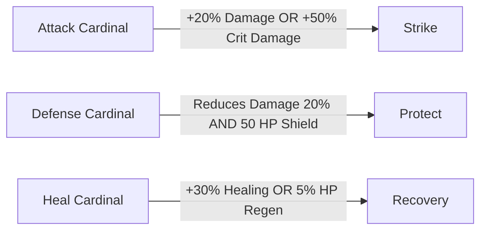

# ❤️ About Cardinals

Cardinals are your partners in battle, each offering unique abilities and bonuses based on their type.

Lore: Cardinals are celestial beings coming from another dimension to the realm of Mythical. They are guides for the chosen one. You are the chosen one and so are your Luminals.
Cardinals came to you or will come to you thanks to your Luminals and their unique personalities. They will then bond with you and help you in your journey.

## Cardinal Types

## Cardinal Levels
If you meet twice with the same Cardinal, it will level up. The higher the level, the more powerful the Cardinal will be.
For now, the level doesn't impact anything but will be used in the future for more features.

## ABOUT: SYMBIOSIS (Affinity Score)
Each time you bond with a Cardinal, you will increase your affinity score. The higher the affinity, the more possibilities you will have in the future.
Affinity score in Mythical is called: Symbiosis.

Right now symbiosis is used to allow you to place your Cardinal in your house.

In future updates:
- Symbiosis will allow you to unlock new cardinal powers for battle
- Symbiosis will allow you to unlock new cardinal quests

Symbiosis can be increase thanks to the bonding system!

## Bonding System
In Mythical, you can bond with Cardinals. Bonding means one of the following:
- You can talk with them and learn more about their story.
- You can play with them

### > Bonding through stories
In the story mode, you will have available chats with Cardinals and base on your answers you can increase or decrease your bond level with them.

### > Bonding through mini-games
Here is an example of a mini-game that you can play with your Cardinal.

## Cardinal Aesthetics
Each Cardinal has a unique aesthetic. You can customize their look with skins.
Skins are obtained through events or direct purchasefor Mythical Stones.

