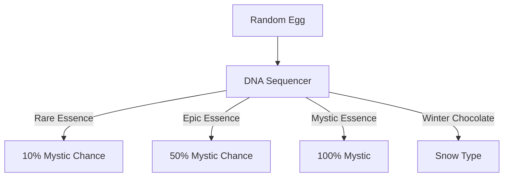

# 🧬 DNA Sequencing System

## Essence Types

1. **Rare Essence**
    - 10% Mystic Chance
    - Common from Infinite Realms (PVE Rewards)
{ width=50 height=50 }

2. **Epic Essence**
    - 50% Mystic Chance
    - At specific milestones in the PVE mode
{ width=50 height=50 }

3. **Mystic Essence**
    - 100% Mystic Chance
    - Rare reward from only latest PVE hardest level
{ width=50 height=50 }

4. **Winter special item: Phearion Chocolate**
    - Snow Type
    - Available during winter event
{ width=50 height=50 }
   

### Note

You might want to save your Mystic Essence for later use, as it is the rarest and most valuable essence type.
The DNA Sequencer has a lot of potential for future updates, so keep an eye out for new essence types and features.